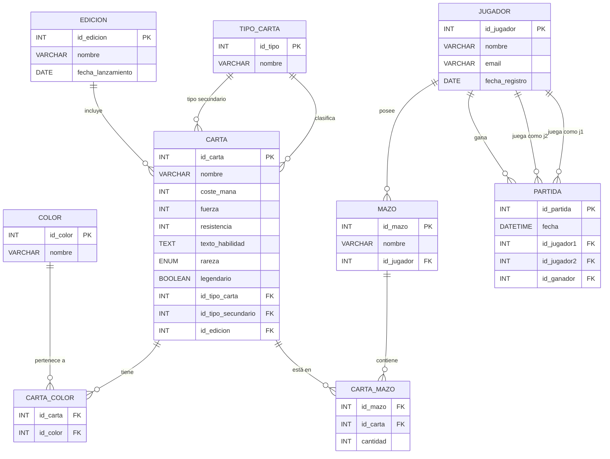

# Modelo Entidad-Relación

## Diagrama

## Entidades y atributos

### CARTA
Entidad central del sistema. Almacena todos los datos de una carta coleccionable.
- `id_carta`: Clave primaria
- `nombre`: Nombre de la carta
- `coste_mana`: Coste numérico total de maná
- `fuerza` / `resistencia`: Solo para criaturas (NULL en otros tipos)
- `texto_habilidad`: Descripción del efecto
- `rareza`: ENUM (Común, Infrecuente, Rara, Mítica)
- `legendario`: Indica si es supertipo Legendario
- `id_tipo_carta`: FK al tipo principal (Criatura, Hechizo, Tierra...)
- `id_tipo_secundario`: FK al tipo secundario opcional
- `id_edicion`: FK a la edición

### TIPO_CARTA
Catálogo de tipos: Criatura, Hechizo, Tierra, Instantáneo, Encantamiento, Artefacto.

### COLOR
Catálogo de colores de maná: Blanco, Azul, Negro, Rojo, Verde, Incoloro.

### CARTA_COLOR
Tabla puente N:M entre CARTA y COLOR (una carta puede tener varios colores).

### EDICION
Colecciones o expansiones del juego.

### JUGADOR
Usuarios registrados en el sistema.

### MAZO
Colección de cartas que pertenece a un jugador.

### CARTA_MAZO
Tabla puente N:M entre MAZO y CARTA con cantidad de copias.

### PARTIDA
Registro de enfrentamientos entre dos jugadores con resultado.

## Relaciones principales

| Relación | Cardinalidad | Descripción |
|----------|-------------|-------------|
| JUGADOR – MAZO | 1:N | Un jugador tiene varios mazos |
| MAZO – CARTA | N:M (via CARTA_MAZO) | Un mazo contiene muchas cartas; una carta puede estar en varios mazos |
| CARTA – COLOR | N:M (via CARTA_COLOR) | Una carta puede tener varios colores |
| TIPO_CARTA – CARTA | 1:N | Un tipo clasifica muchas cartas |
| EDICION – CARTA | 1:N | Una edición incluye muchas cartas |
| JUGADOR – PARTIDA | 1:N | Un jugador participa en muchas partidas |
